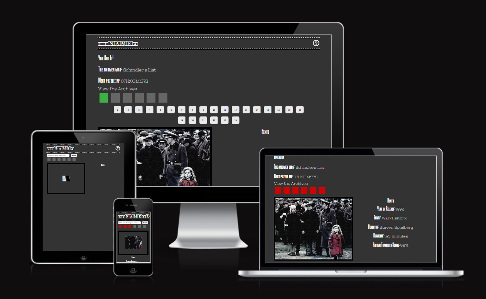
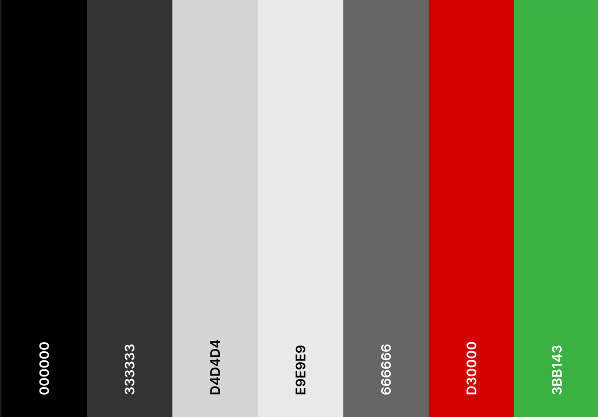
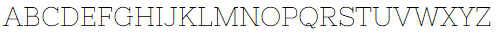
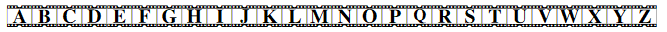
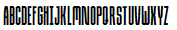
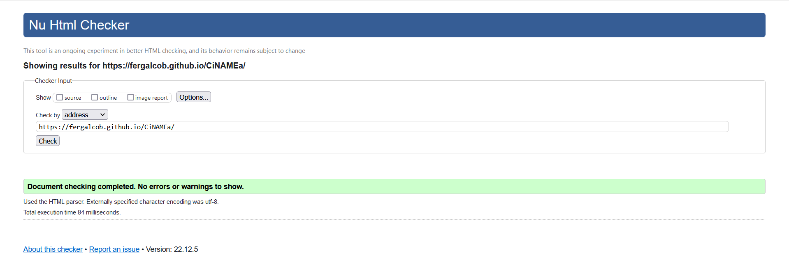
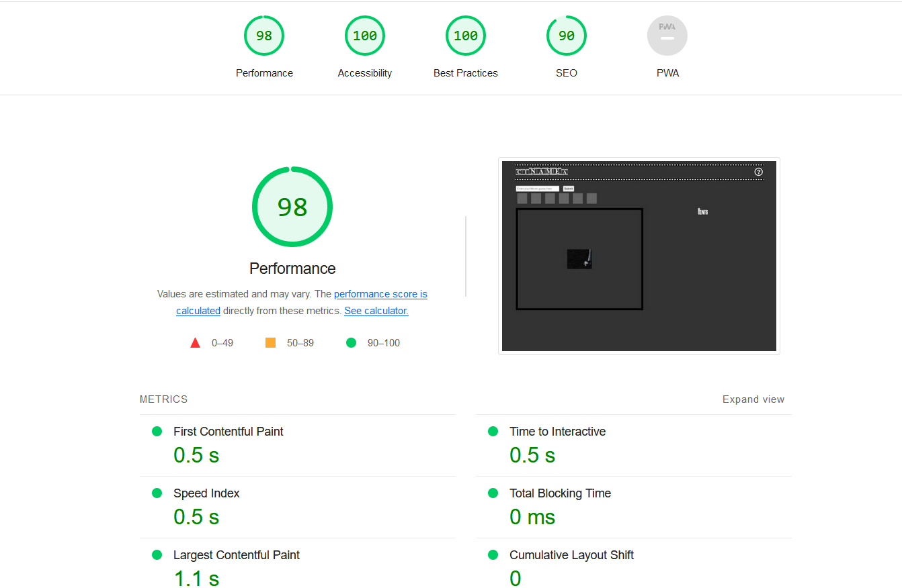
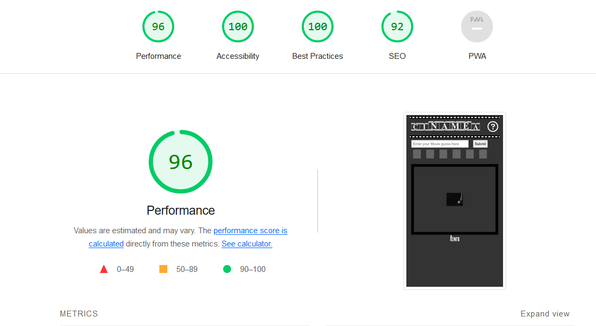
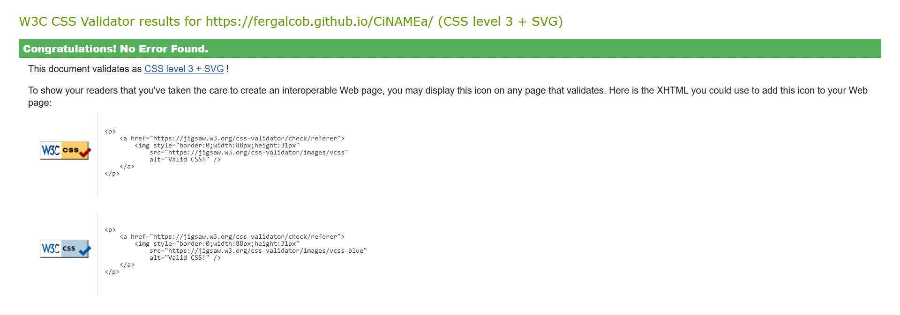
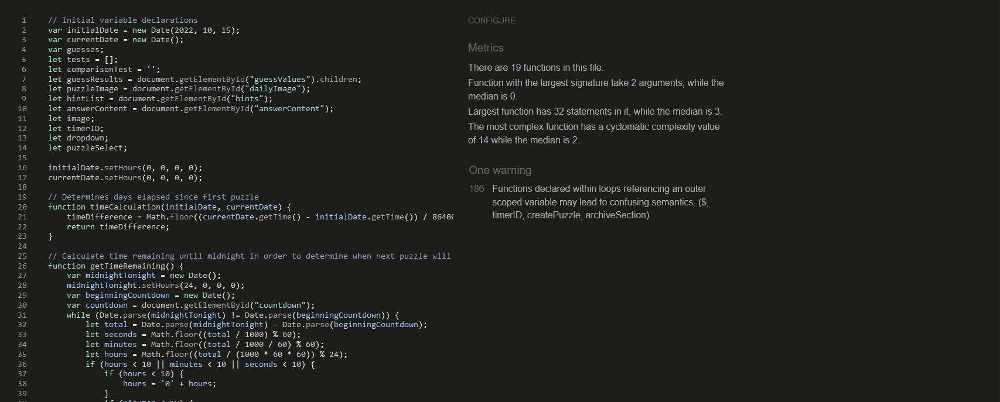

## Live Link
[https://fergalcob.github.io/CiNAMEa/](https://fergalcob.github.io/CiNAMEa/)

## Table of Contents
 - [Site Inspiration](#site-inspiration)
 - [User Stories](#user-stories)
   * [First Time User](#first-time-user)
 - [Features](#features)
   * [Common Features](#common-features)
     1. [Navbar](#navbar)
     2. [Footer](#footer)
   * [Index.html Features](#index.html-features)
     1. [Banner Image](#banner-image)
     2. [Site Aims](#site-aims)
   * [Future Plans](#future-plans)
- [Styling Choices](#styling-choices)
   * [Color Palette](#color-palette)
   * [Typography](#typography)
   * [Favicon](#favicon)
- [Device Testing Results & Known Issues](#device-testing-results--known-issues)
   * [Devices & Browsers Used For Testing](#devices--browsers-used-for-testing)
   * [W3C Validator & Lighthouse Testing](#w3c-validator--lighthouse-testing)
   * [Jigsaw Validation Of CSS](#jigsaw-validation-of-css)
   * [JSHint Validation Of Javascript](#jshint-validation-of-javascript)
   * [Currently Known Issues](#currently-known-issues)
   * [Solved Issues](#solved-issues)
- [Deployment](#deployment)
  * [Github Pages](#github-pages)
- [Technologies Used](#technologies-used)
- [Credits](#credits)
 
 
## Site Inspiration

The inspiration for this site came from the recent trend of daily puzzle games beginning with [Wordle](https://www.nytimes.com/games/wordle/index.html) and continuing into more trivia based options such as [Heardle](https://www.spotify.com/heardle/?), [Framed](https://framed.wtf/) and [GuessThe.Game](https://guessthe.game/) among others. These sites all follow the same general set-up of a daily, 6 guesses puzzle. CiNAMEa takes from these and creates a daily puzzle wherein the user is shown a portion of a movie poster with the title removed and based on their guesses are shown additional portions of the image or are provided hints to the film's identity.

## User Stories

### First Time User

 1. As a first time user, I want to be able to easily understand the goal of the site
 2. As a first time user, I want to clearly understand how to interact with the site's content
 3. As a first time user, I want to be able to access previous content on the site used for prior puzzles

### Returning User

 1. As a returning user, I would like to be find new content on a daily basis
 2. As a returning user, I would like to have easy access to content I may have missed if I have not accessed the site for some time

## Features 

### Index.html features

#### Banner Image

The banner image uses a responsive image-set to react to the device being used to access the site, such as mobile device for mobiles, a tablet for tablets etc. as you can see in the images below. This is both to represent how the site is being accessed at the time, but also to visualize how people interact with emails in these current times and that all types of devices would be important to support in terms of responsiveness.

| Laptop/Desktop Banner |
| --- |
|  |

| Mobile Banner | Tablet Banner |
| --- | --- |
|  |  |

### Future Plans

* To implement content on a continuous basis, with the current project there is a fixed number of puzzles available, with continuous content updates this would remove the current need to loop back on previously used puzzles and also reduce the code load as there would be no need for looping
* To implement archive retention, currently when the archive is accessed the guesses are not retained locally when accessing the site, ideally each puzzle would store it's own unique values for guesses attempted allowing users to see how they performed on previous days

## Styling Choices

### Color Palette

In keeping with other sites in the same genre, the site itself uses a very simple and focused colour palette as the eye should be drawn to the puzzle as the main intention of the site. Using a spread of dark to light grays to keep a general theme in place without any contrast issues

The red(#D30000),green(#3BB143) and grey(#666666) shades are used for the guess boxes to denote unused/incorrect and correct guesses, these choices are due to their ease of understanding by users from their common usage with the red for incorrect, green for correct and grey for unanswered.

### Typography

Nixie One:  
  
Movie Times:  
  
Due Credit:  
  

For the font choices for the site, we have three primary options, Nixie One, Movie Times & Due Credit which can all be seen above. These choices were to keep in the theme of and to suggest the imagery of movies. With Movie Times being used for the logo title, the font itself with the film strip borders gives an clear initial idea as to what the site itself would be regarding but it was a choice to use this font sparingly due to the large filmstrip borders.

Nixie One and Due Credit are then used for the main content of the page, with Due Credit evoking the text from movie poster credits and being used for the hint and answer titles. Nixie One then being used for the text content such as the hints/answers and the overlay's help text, similarly to Due Credit, this was chosen due to being a typeface similar to typewriter script as would be seen commonly in movies. 

### Favicon

The favicon was created specifically for the site itself, with the imagery of the two Ms, one overlaid upon the other representing the site name "Mail Matters" while also being evocative of an envelope to bring it together with the email focused nature of the site itself.

## Device Testing Results & Known Issues

### Devices & Browsers Used For Testing

1. Laptop(Acer Nitro 5 & Lenovo Ideapad 5)
    * Chrome
    * Edge
    * Firefox

2. Android Phone(Realme 9 Pro & Samsung S21)
    * Chrome
    * Firefox

3. Android Tablet(Lenovo Tab)
    * Chrome

### W3C Validator & Lighthouse Testing

  
index.html results - Validator and Lighthouse

  
  #### W3C Validator Results
  
  
  #### Lighthouse Results - Desktop
  
  
  #### Lighthouse Results - Mobile
  

### Jigsaw Validation Of CSS

### JSHint Validation Of Javascript

### Currently Known Issues

1. When using Firefox on Android mobile devices, on the Contact page, when scrolling with the dynamic address bar enabled and is positioned at the bottom of the screen, when the address bar is hidden due to the scroll, there is empty space left where the address bar would be until the scrolling reaches the footer. This has been reported as a bug previously [here](https://github.com/mozilla-mobile/fenix/issues/8768) however the workarounds suggested there did not resolve this instance of the issue.

### Solved Issues

1. The banner images on the Index, Basics & Specifics pages were reported to introduce a horizontal scrollbar on browsers with a non-autohiding vertical scrollbar due to the 100vw width that was initially in place for those banner images.
 - Issue resolved by switching to 100% width rather than viewport width
2. On some devices, the code snippet on the Basics page was escaping the div it was contained in causing the page to scroll to the right.
 - Added "word-break: break-word;" to the styling for this section in addition to the pre-existing "white-space: pre-line;" to support a wider range of devices

## Deployment

### Github Pages

1. To deploy the live site, from the Github directory for the project, access the Settings page(indicated by the cog icon) from the navbar.
2. Once in the Settings page, access the Pages subsection from the menu on the left under 'Code and Automation'.
3. From here, you want to choose the source for the site, in this case 'Deploy from branch' is used as the source, followed by choosing the branch, in this case it's 'Main' and '/root'
4. All that needs to be done from there is to save those settings and allow 5-10 minutes for deployment to complete.
5. At that point, the page was then live at [https://fergalcob.github.io/Mail-Matters/](https://fergalcob.github.io/Mail-Matters/)

## Technologies Used
* [HTML5](https://en.wikipedia.org/wiki/HTML5)
   - Used to build the underlying structure of the website and to add the content for users
* [CSS](https://en.wikipedia.org/wiki/CSS)
   - Used to provide the styling necessary to set the final layout of the site and to implement responsiveness across device types
* [GIMP](https://www.gimp.org/) 
   - Used for scaling the banner images for responsiveness
* [Am I Responsive](https://ui.dev/amiresponsive) 
   - For testing and creating the Readme banner image
* [Coolors](https://coolors.co)
  - Used to create the color palette shown in the Readme
* [jQuery](https://jquery.com/)
  - Used to reload the text input field after selecting a puzzle from the Archives
* [RealFaviconGenerator](https://realfavicongenerator.net/)
  - Used for generating the favicon set and code from the personally  created icon

## Credits
* Banner images courtesy of [123rf.com](https://www.123rf.com/)
* Movie posters used for the daily puzzles courtesy of [MovieMania](https://www.moviemania.io/)
* Help Overlay & Overlay Close Icons from [Font Awesome](https://fontawesome.com/)
* [W3CSchools](https://www.w3schools.com/) for their tutorial & code on overlay creation

